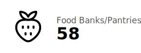
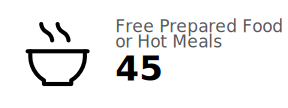
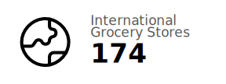
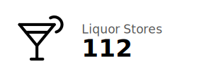
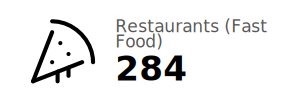
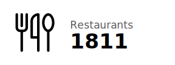
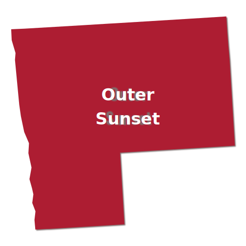
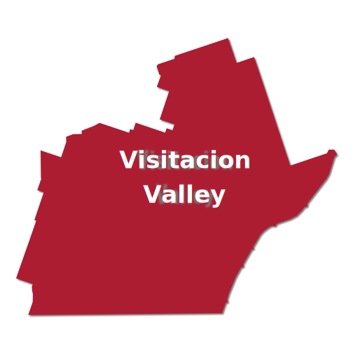

```{r setup, include=FALSE}
knitr::opts_chunk$set(echo = FALSE)

# Learn more about creating websites with Distill at:
# https://rstudio.github.io/distill/website.html

```

<!-- <link href="https://unpkg.com/tailwindcss@^2/dist/tailwind.min.css" rel="stylesheet"> -->

```{r}
source(here::here("R", "interactive-maps.R"))
```

::: {.xl:grid .xl:grid-cols-3 .xl:gap-16 .l-screen-inset .mt-24 .xl:mb-16 .xl:mx-64}
::: {.xl:col-span-2}

<h1 class="text-4xl font-bold mb-4">

API Food Assets Map

</h1>

<p>

This asset map visually depicts various food resources across San
Francisco, with a special emphasis on regions with larger concentrations
of Asian Pacific Islander (API) residents. The map aims to expand the
understanding of food access and systems within and across API
communities in San Francisco, serving as a starting point to explore how
API community members access food, interact with various typologies of
food (e.g., charitable food, grocery stores/markets, restaurants), and
experience their community's food resources. Potential also exists for
better understanding the nexus of cultural preservation, economic
health, and transportation/mobility. This map was created with funds
from the <a href="https://stupski.org/">Stupski Foundation</a>, as part
of a larger food access and security project in April-June 2021.

</p>
:::

::: {.xl:col-span-1 .mx-auto}

:::
:::

```{r map, layout = "l-screen-inset", fig.height = 8}
draw_resource_map()
```

::: {.mx-auto .inline .text-gray-600}
Accepts SNAP/WIC
:::

::: {.sm:grid .sm:grid-cols-2 .xl:grid-cols-4 .sm:gap-4 .md:gap-8 .l-page .my-16}
<div>


</div>

<div>


</div>

<div>


</div>

<div>



</div>

<div>


</div>

<div>



</div>

<div>



</div>

<div>



</div>

<div>



</div>

<div>



</div>

<div>


</div>
:::

::: {.l-screen-inset .my-16}
<h2 class="text-4xl text-center font-bold mb-16">

Neighborhoods

</h2>

::: {.sm:grid .sm:grid-cols-2 .xl:grid-cols-5 .sm:gap-16}
<div>

<a href="bayview-hunters-point.html">

</a>

</div>

<div>

<a href="chinatown.html">
 </a>

</div>

<div>

<a href="excelsior.html">
 </a>

</div>

<div>

<a href="inner-sunset.html">
 </a>

</div>

<div>

<a href="japantown.html">
 </a>

</div>

<div>

<a href="outer-sunset.html">
 </a>

</div>

<div>

<a href="richmond.html"> 
</a>

</div>

<div>

<a href="soma.html">  </a>

</div>

<div>

<a href="tenderloin.html">
 </a>

</div>

<div>

<a href="visitacion-valley.html">
 </a>

</div>
:::
:::

::: {.mt-24}
<h2 class="text-4xl font-bold">Data Sources</h2>
:::

Data for this map comes from a variety of sources.

The neighborhood demographics data comes from the [2019 American
Community Survey](https://www.census.gov/programs-surveys/acs) (5-year
estimates).

Much of the data on food resources (including corner stores/convenience
stores, drug stores, farmers markets, liquor stores, restaurants, and
supermarkets/grocery stores) comes from
[OpenStreetMap](https://www.openstreetmap.org/).

Many of the supermarkets/grocery stores identified using OpenStreetMap
were manually tagged as international grocery stores. In addition, this
category was supplemented by lists taken from [SF
Gate](https://www.sfgate.com/food/article/The-Bay-Area-s-best-international-markets-11157138.php#taboola-9)
and [this 2014 guide](https://ss-biggie.livejournal.com/42231.html).

Additional data on farmers markets also comes from the [San Francisco
Department of the
Environment](https://sfenvironment.org/farmers-markets-in-sf).

Data on food banks comes from the [San Francisco Marin Food Bank
website](https://www.sfmfoodbank.org/find-food/) while data on food
pantries comes from
[foodpantries.org](https://www.sfmfoodbank.org/find-food/).

Data on food pharmacies, a [novel
program](https://www.sfproduce.org/food-pharmacy) led by the [The Food
As Medicine
Collaborative](https://www.hellmanfoundation.org/food-as-medicine-collaborative.html),
was inputted manually.

Data on stores that accept Supplmentary Nutrition Assistance Program
(SNAP) comes from the [United States Department of Agriculture
website](https://www.fns.usda.gov/snap/retailer-locator). The website
[wicstorelocator.com was used to gather data on stores that participate
in the Women, Infants and Children (WIC) supplemental nutrition
program](https://www.wicstorelocator.com/ci/ca-san_francisco).

Data on stores that accept SNAP/WIC was combined with data taken from
other sources above. Efforts were made to remove duplicates, though some
may have slipped through the cracks.

