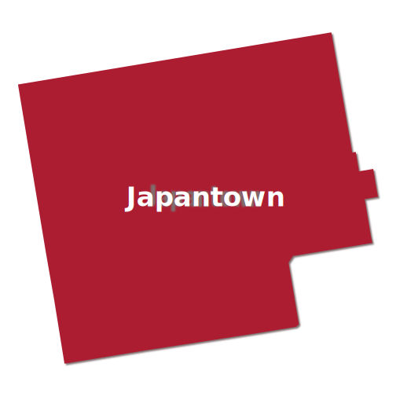

```{r setup, include=FALSE}
knitr::opts_chunk$set(echo = FALSE)

# Learn more about creating websites with Distill at:
# https://rstudio.github.io/distill/website.html

```

```{r packages}
library(tidyverse)
library(leaflet)
library(leafem)
library(tigris)
library(here)
library(sf)
library(janitor)
library(pluralize)
library(crosstalk)
```

```{r colors}
dark_red <- "#AD1D32"
light_red <- "#E00052"
off_white <- "#FDFAF9"
gray <- "#806E6E"
light_gray <- "#ECF0F1"
```

```{r import_data, results = 'hide'}
## boundary for San Francisco

sf_boundary <- counties(state = "California", cb = TRUE) %>%
  clean_names() %>%
  filter(name == "San Francisco") %>%
  st_transform(4326)


## read in data for map

clean_interval <- function(x){
  str_remove_all(x, "\\[|\\]|\\(|\\)") %>% str_replace(",", " to ") %>% paste0("%")
}

demographics <- read_rds("data/api_neighborhood_data.rds") %>%
  mutate(pct_api_interval = cut(pct_api_clean, breaks = c(0, 16, 22, 34, 44, 100), include.lowest = TRUE, ordered = TRUE),
         pct_api_category = fct_relabel(pct_api_interval, clean_interval))

food_resources <- read_rds("data/full_dataset.rds") %>%
  st_join(demographics %>% select(nhood)) %>%
  filter(city == "San Francisco") %>%
  st_intersection(sf_boundary %>% select()) %>%
  mutate(category = factor(category),
         icon_url = case_when(category == "Corner Stores" ~ "assets/corner-stores.svg",
                      category == "Drug Stores" ~ "assets/drug-stores.svg",
                      category == "Food Banks/Pantries" ~ "assets/food-banks-pantries.svg",
                      category == "Food Pharmacies" ~ "assets/food-pharmacy.svg",
                      category == "Free Prepared Food or Hot Meals" ~ "assets/free-prepared-hot-meals.svg",
                      category == "Liquor Stores" ~ "assets/liquor-stores.svg",
                      category == "International Grocery Stores" ~ "assets/international-grocery-stores.svg",
                      category == "Restaurants (Fast Food)" ~ "assets/restaurants-fast-food.svg",
                      category == "Restaurants" ~ "assets/restaurants.svg",
                      category == "Supermarkets" ~ "assets/supermarkets.svg",
                      category == "Farmers Markets" ~ "assets/farmers-market.svg",
                      TRUE ~ NA_character_
  )
  )

```


```{r design}
groups <- c(
  "Corner Stores" <- "Corner Stores",
  "International Grocery Stores" <- "International Grocery Stores",
  "Drug Stores" <- "Drug Stores",
  "Farmers Markets" <- "Farmers Markets",
  "Food Banks/Pantries" <- "Food Banks/Pantries",
  "Food Pharmacies" <- "Food Pharmacies",
  "Free Prepared Food or Hot Meals" <- "Free Prepared Food or Hot Meals",
  "Liquor Stores" <- "Liquor Stores",
  "Restaurants" <- "Restaurants",
  "Restaurants (Fast Food)" <- "Restaurants (Fast Food)",
  "Supermarkets" <- "Supermarkets"
)

## color palettes

demo_pal <- colorFactor(
  palette = "PuBuGn",
  domain = demographics$pct_api_category,
  na.color = "#FFFFFF40")

## popups

# make popup text with name, address, notes, and link to website
food_resources <- food_resources %>%
  mutate(singular_category = singularize(category),
           popup = paste("<span font-family: 'Catamaran'>",
                       "<span style='font-weight:700; font-size:12px; color: #6B7280;'>", singular_category,"</span>", "<br/>",
                       "<span style='font-weight:700; font-size:16px; color: #111827'>", name,"</span>", "<br/>",
                       "</span>",
                       sep='')) %>%
  filter(category %in% groups) # for now, filter out the SNAP/WIC category


demographics <- demographics %>%
  mutate(popup = case_when(
    !is.na(pct_api_clean) ~  paste("<span font-family: 'Catamaran'>",
                       "<span style='font-weight:700; font-size:12px; color: #111827'>", nhood,"<br></span>",
                       "<span style='font-weight:700; font-size:16px; color: #6B7280;'>", pct_api_clean, "% Asian or Pacific Islander alone", "</span>", "<br/>",
                       "<span style='font-weight:700; font-size:12px; color: #111827'>", "2019 5-year ACS","</span>", "<br/>",
                       "</span>",
                       sep=''),

    is.na(pct_api_clean) ~ paste("<span font-family: 'Catamaran'>",
                       "<span style='font-weight:700; font-size:12px; color: #111827'>", nhood,"<br></span>",
                       "</span>",
                       sep='')))


```

<link href="https://unpkg.com/tailwindcss@^2/dist/tailwind.min.css" rel="stylesheet">


<div class="grid grid-cols-2 gap-16 l-screen-inset my-16 mx-64">

<div>

<h1 class="text-4xl font-bold mb-4">API Food Assets Map</h1>

<p>The following asset map visually depicts various food resources across San Francisco, with a special emphasis on regions with larger concentrations of Asian Pacific Islander (API) residents. The existence of this map aims to expand the understanding of food access and systems within and across API communities in San Francisco, serving as a starting point to explore how API community members access food, interact with various typologies of food (e.g., charitable food, grocery stores/markets, restaurants), and experience their community’s food resources. Potential also exists for better understanding the nexus of cultural preservation, economic health, and transportation/mobility. This map was created with funds from the Stupski Foundation, as  a part of a larger food access and security project in April-June 2021.</p>
</div>

<div>

</div>


</div>


```{r map, layout = "l-screen-inset", fig.height = 8}

map <- leaflet() %>%
  addProviderTiles(provider = providers$CartoDB.Positron) %>%
  addPolygons(data = demographics, group = "Show API Population<hr padding:0px;margin:0px;>", fillColor = ~demo_pal(pct_api_category), color = gray, weight = 1, fillOpacity = .8, popup = ~popup) %>%

  # legends

  addLegend(position = "bottomright", pal = demo_pal, values = demographics$pct_api_category, opacity = .8, title = "% Asian or Pacific Islander<br><span style='font-weight:700; font-size:12px;'>ACS 2019 (5-year), quantile breaks", group = "Show API Population<hr padding:0px;margin:0px;>", na.label = "Data not available", labels = c("Less than 16%", "16 to 22%", "22 to 34%", "34 to 44%", "Greater than 44%"))


# use walk from per to return m after adding each layer
groups %>%                     # get names of resource groups
  walk(function(x)                         # then walk through vector of names one at a time
    map <<-
      map %>%
      addMarkers(data = food_resources %>% filter(category == x),
                 icon = makeIcon(iconUrl = ~icon_url, iconWidth = 20, iconHeight = 60),
                 popup = ~popup,
                 group = x,
                 clusterOptions = markerClusterOptions()))

map <-
  map %>%
  addLayersControl(
    overlayGroups = c("Show API Population<hr padding:0px;margin:0px;>",  groups),
    position = "bottomleft",
    options = layersControlOptions(collapsed = FALSE)
  ) %>%
  hideGroup("Show API Population<hr padding:0px;margin:0px;>")

map


```

<h2 class="text-4xl font-bold mb-4">Neighborhoods</h2>

<div class="grid grid-cols-3 gap-16 l-screen-inset my-16 mx-64">

<div>

</div>

<div>

</div>

<div>

</div>

</div>
