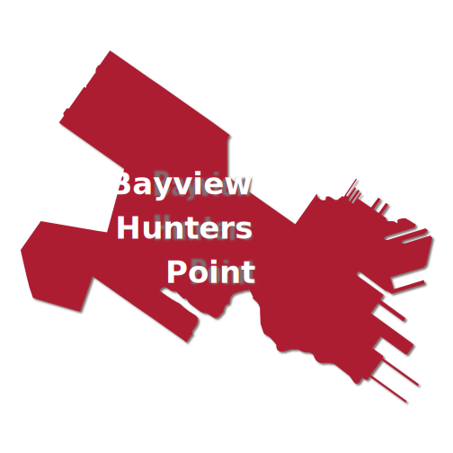
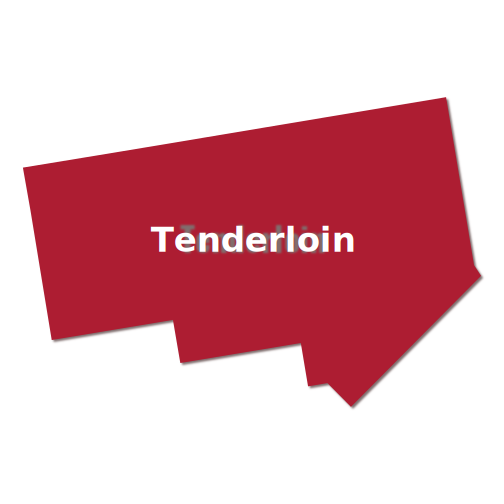

```{r setup, include=FALSE}
knitr::opts_chunk$set(echo = FALSE)

# Learn more about creating websites with Distill at:
# https://rstudio.github.io/distill/website.html

```

<!-- <link href="https://unpkg.com/tailwindcss@^2/dist/tailwind.min.css" rel="stylesheet"> -->

```{r}
source("R/interactive-maps.R")
```


<div class="sm:grid sm:grid-cols-3 sm:gap-16 l-screen-inset sm:mt-24 sm:mb-16 sm:mx-64">

<div class="sm:col-span-2">

<h1 class="text-4xl font-bold mb-4">API Food Assets Map</h1>

<p>The following asset map visually depicts various food resources across San Francisco, with a special emphasis on regions with larger concentrations of Asian Pacific Islander (API) residents. The existence of this map aims to expand the understanding of food access and systems within and across API communities in San Francisco, serving as a starting point to explore how API community members access food, interact with various typologies of food (e.g., charitable food, grocery stores/markets, restaurants), and experience their community’s food resources. Potential also exists for better understanding the nexus of cultural preservation, economic health, and transportation/mobility. This map was created with funds from the Stupski Foundation, as  a part of a larger food access and security project in April-June 2021.</p>
</div>

<div class="col-span-1">

</div>


</div>


```{r map, layout = "l-screen-inset", fig.height = 8}
draw_resource_map()
```


<div class="mx-auto inline text-gray-600"><span>Accepts SNAP/WIC</span><span>Does Not Accept SNAP/WIC</span></div>


<div class="grid grid-cols-4 gap-8 l-page my-16">

<div>

</div>

<div>

</div>

<div>

</div>

<div>

</div>

<div>

</div>

<div>

</div>

<div>

</div>

<div>

</div>

<div>

</div>

<div>

</div>


<div>

</div></div>


<div class="l-screen-inset my-16">

<h2 class="text-4xl text-center font-bold mb-16">Neighborhoods</h2>

<div class="grid grid-cols-5 gap-16">

<div>
<a href="bayview-hunters-point.html">

</a>
</div>

<div>
<a href="chinatown.html">

</a>
</div>

<div>
<a href="excelsior.html">

</a>
</div>

<div>
<a href="inner-sunset.html">

</a>
</div>

<div>
<a href="japantown.html">

</a>
</div>

<div>
<a href="outer-sunset.html">

</a>
</div>

<div>
<a href="richmond.html">

</a>
</div>

<div>
<a href="soma.html">

</a>
</div>

<div>
<a href="tenderloin.html">

</a>
</div>

<div>
<a href="visitacion-valley.html">

</a>
</div>

</div>

</div>

<div class="mt-24">
<h2 class="text-4xl font-bold">Data Sources</h2>
</div>


<p>Lorem ipsum dolor sit amet, consectetur adipiscing elit, sed do eiusmod tempor incididunt ut labore et dolore magna aliqua. Purus faucibus ornare suspendisse sed nisi lacus sed viverra tellus. Et ligula ullamcorper malesuada proin libero nunc consequat. Proin libero nunc consequat interdum varius sit. Maecenas pharetra convallis posuere morbi leo. Ipsum dolor sit amet consectetur. Dolor sit amet consectetur adipiscing elit duis tristique. Sit amet cursus sit amet dictum sit. Non sodales neque sodales ut etiam sit amet. Fermentum odio eu feugiat pretium nibh ipsum. Neque aliquam vestibulum morbi blandit cursus risus at ultrices mi. Maecenas pharetra convallis posuere morbi. Bibendum ut tristique et egestas quis ipsum suspendisse.</p>


